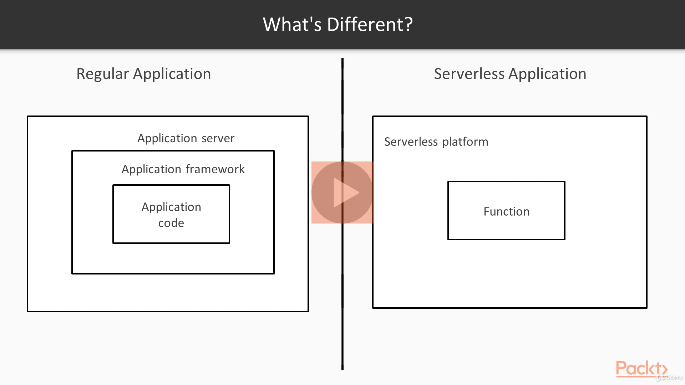
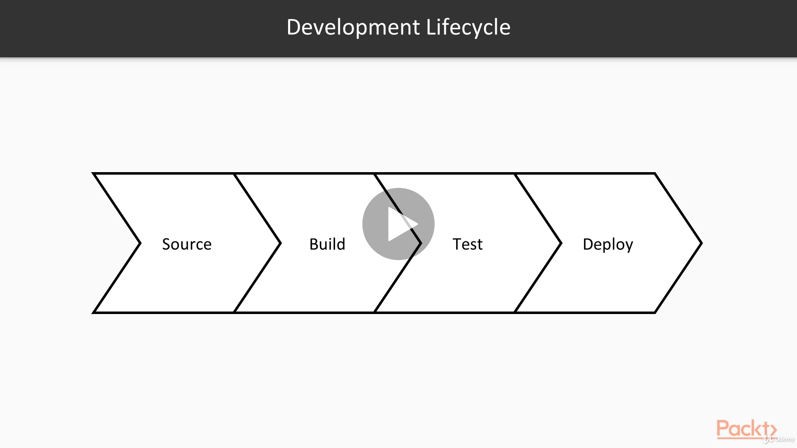
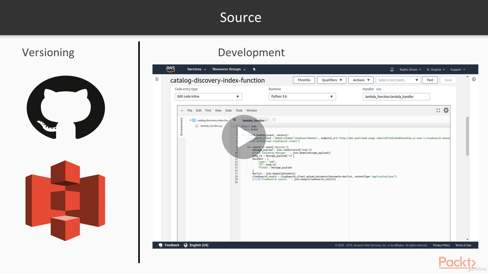

# Microservices Architecture

## Reference Documentation

This review of concepts is a summary for the section dealing with Serverless Architectures of Dimos Raptis's course on Udemy.

This is based primarily on the reference below:

* [Microservices Architecture](https://www.udemy.com/course/microservices-architecture/)

## Features

These are the key features that we'll cover in this review:

- Introduction to Serverless Computing

- Development Lifecycle of Serverless Applications

- Caveats of the Serverless Model

# Serverless Architectures

In this section, we'll get an introduction to the concept of Serverless Computing and its benefits.

We'll also demonstrate how we can build a serverless application, what are the caveats we should consider and what are the main differences to regular applications.

We will cover three basic parts. We'll start by introducing the concept of Serverless Computing, looking at the benefits that make it worth investing time in it.

In the next topic, we will investigate how the development lifecycle differs between regular and Serverless Applications.

In the last part, we will conclude by explaining some of the caveats of Serverless Computing and look at some cases where it might not be the best choice.

## Introduction to Serverless Computing

In this first part, we will make an introduction to the term Serverless Computing, give a general overview of how it works and what are the main benefits it brings.

## Serverless Computing

First of all, let's have a quick look at the term Serverless Computing and what it means.

Because of its origin, this term has  created several  misunderstandings, since some people believe that it is a way to execute software without running any server at all.

Of course this is not possible.

`Serverless Computing is a Cloud Computing execution model in which the Cloud Provider dynamically manages the allocation of machine resources.`

In reality, the software is being executed in a server, but this is managed by the Cloud Provider and is opaque to us.

## How It Works

### Programming Model

Let's start by looking at what the progamming model of Serverless Computing is.

The developer can define and register a Function.

Then, there are various ways to make use of this Function.

One way is to trigger the Function based on some requests of the user and return the Function's result back to the user as an HTTP response.

Another way is to trigger the Function as a response to an event that happened.

To give an example, a Function can be executed every time a user is uploading a file in a specific location.

Lastly, we can also trigger this Lambda Function programmatically from a different piece of code.

The main enabler for Serverless Computing has been the concept of Containers.

We don't have a lot of time to explore this concept, but briefly it's an alternative to virtual machines which allows us to have many processes in a single machine, which appear as different machines that are very lightweight and fast to start up.

To achieve the illusion of Serverless Computing, we can have a pool of servers and execute these Functions inside separate Containers.

### Technical Implementation

The main workflow is the following.

Every time a Function needs to be invoked, the platform checks whether there is a live Container running that Function already.

If not, then a new Container will be started and the Function will be executed in it.

If there isn't a live Container, the platform might check whether this Container is able to execute one more Function.

If that's true, the Function will be executed in the same Container. Otherwise, a new Container will be started.

Of course the platform is responsible for other tasks, such as shutting down idle Containers to save resources and scaling the pool of servers based on the incoming traffic to ensure there will always be available servers for a new Function.

Of course we should keep in mind that this is a simplified overview which might differ between implementations and providers.

How It Works, by Dimos Raptis, [Udemy](https://www.udemy.com/course/microservices-architecture/).

## Benefits

Now that we have seen how it works, let's explore what are the main benefits of Serverless Computing.

- Cost

- Operations

- Developer Productivity

- Scalability

The biggest benefit Serverless Computing brings is cost efficiency.

When running regular applications, we pay for the resources we use, regardless of how much we use them.

However, in the Serverless Model, we are being charged on the number of times our Function is invoked.

As a result, we don't have to pay any more for idle servers, saving a lot of money.

Another significant advantage is reduced operations, since the management of servers is now fully done by the Cloud Provider without us having  to do anything.

On top of that, the Serverless Model can increase productivity in software development. Engineers can skip writing a lot of infrastructure boilerplate code and only write the business logic code.

For instance, engineers don't need to write multi-threaded code, since the model already provides parallel execution by default.

Last but not least, less work is required to make the application scalable, since most Serverless Platforms provide auto scaling capabilities. Of course, this comes with some caveats that we'll see in the next parts.

## Approaches

### Cloud

There are two main ways to leverage Serverless Computing for our applications.

The first and easiest way is to use services provided by Cloud Providers. 

The Serverless ecosystem has been developing with fast pace.

As a result, we can easily confirm that most of the major public Cloud Providers have offerings for developing Serverless Applications.

### On-Premise

However, there are also frameworks that can help us to create such a platform in our On-Premise private data center.

This means that we will be able to utilize our resources more efficiently, allowing us to minimize idle time.

Still, we probably won't be able to have the elasticity that public providers can offer by having much larger resource tools shared across all their clients.

# Development Lifecycle of Serverless Applications

In this section, we'll explore what are the changes in the software development lifecycle when we are developing a Serverless Application.

## What's Different?

### Regular Application versus Serverless Application

First, let's look at the differences between a Regular and a Serverless Application at a very high level.

As we've seen in the first sections of the course, the main core of a Regular Application is the application logic, which is usually developed inside of an application framework.

All of that is executed in an application server.

On the other hand, in a Serverless Application, we only have our Function, which is executed inside the Serverless Platform.

The differenciating factor here is reproducibility.

In a regular application, we can execute our service in our Local environment the same way it will be executed in Production. That's not always true for a Serverless Application, where our Function executes inside a Serverless Platform that acts as a big piece of middleware, and it's sometimes hard to simulate locally.

What's Different, by Dimos Raptis, [Udemy](https://www.udemy.com/course/microservices-architecture/).

### Development Lifecycle

This discrepancy has some implications on the various parts of the Software Development Lifecycle.

Here, we'll look at some parts of the lifecycle, more specifically: 

- The Source part, which is about how we store and change the source code

- The Build part, which is about we build the software, and we generate the final artifact that is used for execution

- The Test part, which contains the various tests we use to verify our software 

- The Deployment phase, which is related how we deploy and operate our software

Development Lifecycle, by Dimos Raptis, [Udemy](https://www.udemy.com/course/microservices-architecture/).

### Versioning

The first aspect of Source code is where we store it and how we version it.

Things don't change a lot here regarding Serverless Applications. We can use regular versioning systems, such as GitHub, or we can use alternative stores that might have better integration with a Serverless Platform we are using, such as S3 for AWS.

### Development

As far as Development is concerned, the various available Serverless Platforms provide different tools that can help.

For example, we've seen that AWS provides an in-browser code editor, where we can dynamically change the code of our Lambda Function.

This might provide great ease of use, but it might not be the best choice in terms of maintainability, safety and collaboration between developers.

Some platforms provide plugins for the various IDE's, which can help us maintain workflow very similar to the one we use when developing regular applications. 

This topic depends a lot on the Platform we are going to use, so we need to invest some time to explore the tools available and make sure that we create a workflow that allows developers to be productive and release software in a safe and reproducible way.

Source, by Dimos Raptis, [Udemy](https://www.udemy.com/course/microservices-architecture/).

### Build

Assuming that we have a way building the software locally in our machine, then the build process does not differ drastically for Serverless Applications.

The build artifact that we'll need depends on two factors.

- Build artifact depends on:

	- Programming Language

	- Serverless Platform

- Need to build "fat" artifacts

The first one is the Programming Language.

For instance, most dynamic languages such as Python, require a zip file containing all the code.

However, some languages might provide alternatives, like Java, where we can use a standalone Jar file as an artifact.

A second factor that might affect the artifacts we need to build is the Serverless Platform we have selected to use.

An important thing to keep in mind is that in most platforms, no libraries or a minimal number of them, will be available to our Function.

As a result, we will most likely need to create an artifact that will also contain the code of all its dependencies. This is usually called a `fat artifact`, because it is usually much bigger than the size of our code.

### Test

As we've already discussed so far, testing is a very important part of developing software.

So, let's look at the options we have for Serverless Applications.

As we've explained, there are different categories of tests, so we'll look at them separately.

- Unit Testing

	- Harder to simulate the 
	
	- Amount of business logic is usually limited

- Integration Testing

- Load Testing

Unit testing tends to be a bit harder and more complicated for Serverless Applications. The main reason is it can be hard to simulate the dependencies and all the functionality provided by the Platform.

Also, Serverless Applications usually do not have a lot of business logic and are used as integration pattern between different systems.

For this reason, Unit Testing is not going to provide a lot of value, considering the effort required.

Nonetheless, there is a lot of effort currently to provide facilities for making Unit Testing easier for Serverless Applications.

For example, AWS provides a framework called Serverless Application Model, which allows to define and auto-generate the components of our Serverless Application.

It also provides an easy way to execute our Function locally, and even simulate actions from our dependencies, such as event sources.

Integration Testing is not very different for Serverless Applications. If we are exposing our Lambda Function via HTTP, then we can deploy it and test it just by making some HTTP requests.

If it's triggered by some events, we might need to set up some additional services, and use those to trigger indirectly our Function, and verify its results.

To do that, we'll need to have different environments for our Serverless Application, which we'll discuss in the next slide.

Load Testing can be performed the same way as Integration Testing, but it's mentioned separately because Load Testing has a different meaning in the Serverless Application.

As we've discussed previously, in a Serverless Application, we don't have access to some things done by the Platform, such as Scaling. This does not mean that we cannot learn anything from Load Testing. It just means that we might have less flexibility to improve things.

### Deploy

Now we'll talk about how we can deploy a Serverless Application in Production.

As we've seen in the past, what we really need is a way to have multiple environments that form a pipeline, where software flows from one stage to the next one after some verification steps.

The way to achieve that differs from platform to platform.

So we'll look at AWS, since that's the platform we use in our example.

AWS Lambda has two main concepts that can help us in that: the Versions and the Aliases.

- Version: Immutable Copy of Code

- Alias: Mutable Pointer to a Version

- Each Version/Alias has a different ARN

- $LATEST version can be used for Development

A Version is a copy of our Function and any associated configuration, while an Alias is a pointer to one of the available Versions.

Using these two concepts, we can have one Alias for each stage of our Pipeline.

As we change our Serverless Application, we publish new Versions of the Lambda Function. Then, we promote this Version to each Alias incrementally, as we verify, each stage with a relevant test.

The nice thing is that versions and aliases have unique ARN's, which are resource identifiers for AWS.

That gives a lot of flexibility when building our pipeline.

For example, when setting up event sources, we can use a specific alias so that events are sent only to a specific stage.

When we create a Function, the latest version is created, which can be used for Development from then on, publishing a new version each time we want to merge our changes.

# Caveats of the Serverless Model

In this section, we'll explore some of the caveats of Serverless Computing, looking at some cases, where building a Serverless Application might not be the right choice.

## Trade-Off

As we've probably realized so far, the world of software is full of trade-offs.

This means that there is not a single solution for everything, but it all depends on various aspects of a problem.

For this reason, we need to present both aspects of Serverless Computing. We've described so far what are the strengths and where we should consider building a Serverless Application.

Now we'll briefly look at some cases when a Serverless Application might not be the best solution.

### Cold Starts

A typical issue of Serverless Applications is what's called `Cold Starts`.

As we've explained previously, when a Function is idle for a long time, the Container that's running it is shut down to save resources. That means that the first request that will follow will have a higher latency than normal, because of the time needed to start up the Container before running the Function.

There are ways to mitigate this issue, such as keeping a Serverless Application hot by triggering it artificially every once in a while. But all these mechanisms just mitigate the issue, and don't eliminate it completely.

This means that the Serverless Model is not very suitable for applications that are latency sensitive, such as customer facing applications.

### Resource Limits

Another limitation is the fact that most Serverless Platforms impose some upper limits on the resources available.

For example, AWS does not allow more than a thousand concurrent executions of Lambda Functions per account.

As a result of this, using the Serverless Model for a service that is expected to have extremely high traffic might not be the best choice.

### Coupling to the Platform

An additional problem with using a Serverless Platform is that the application might become coupled to the specific platform.

This can make it harder to migrate to another provider when compared to a regular application.

However, this issue is addressed by some Serverless frameworks that provide a common interface to the various providers, preventing in this way this form of coupling.

### Not Suitable for High-Performance Computing

As we might have understood so far, Serverless Applications are not currently suitable for dealing with problems of specific performance requirements.

As an example, leveraging GPU's from a Serverless Application is currently extremely complex, if at all possible.

### Limitations of Stateleness - For Example, Caching and Resource Pooling

A natural characteristic of Serverless Applications is that they are stateless.

This has several implications, such as the fact that we cannot leverage caching or connection pools to databases. This is a thing to keep in mind if we need to build an application that would benefit from such features.

### Harder to Maintain Larger Applications Because of Limited Tooling

Last but not least, as also described previously, because of the immature tooling so far, developing a service with considerable amount of business in a Serverless setting might be harder to maintain.

However, there is a lot of work on this front as well, so things might get better soon.